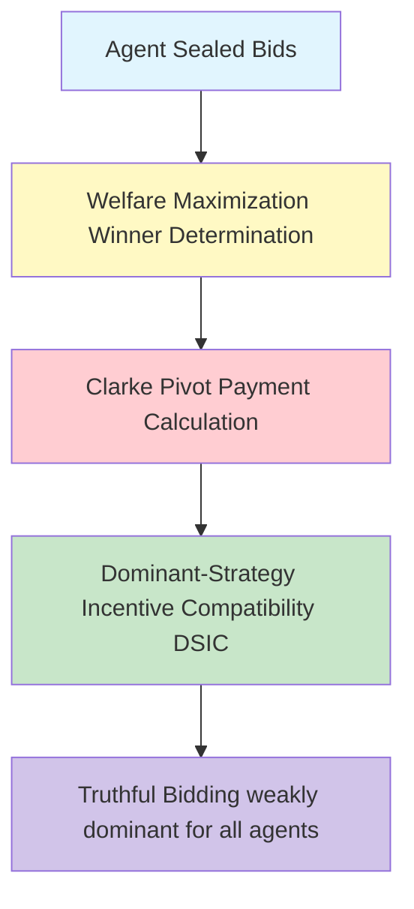

# GenPark Vickrey-Clarke-Groves (VCG) Auction Mechanism Skill

Truthful Vickrey-Clarke-Groves (VCG) auction mechanism with Clarke pivot payments.

Learn more at [GenPark](https://genpark.ai) and the [GenPark MCP Catalog](https://genpark.ai/mcp).

## Features
- Single-item second-price sealed-bid VCG implementation.
- Multi-unit uniform Clarke pivot rule pricing.
- Pure Python standard library.
