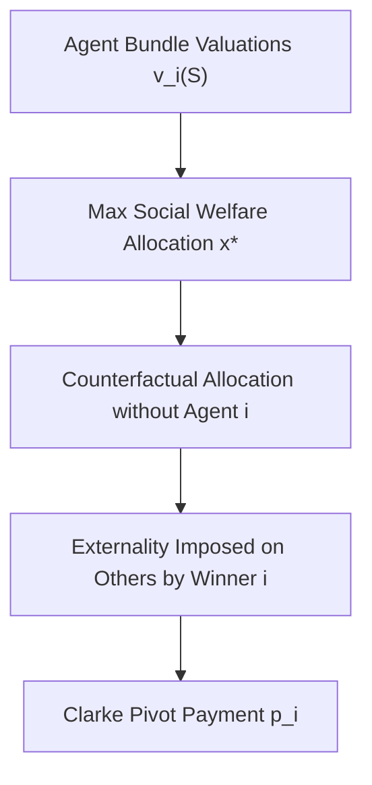

# Vickrey-Clarke-Groves (VCG) Auction Skill

Truthful, dominant-strategy incentive-compatible (DSIC) mechanism for allocating arbitrary discrete resource bundles.

## Features
- **100% Python Standard Library**: Exhaustive combinatorial search engine.
- **Truthful Mechanism**: Truth-telling is a weakly dominant strategy for all bidders.
- **Clarke Pivot Rule**: Guarantees individual rationality and non-negative payments.
